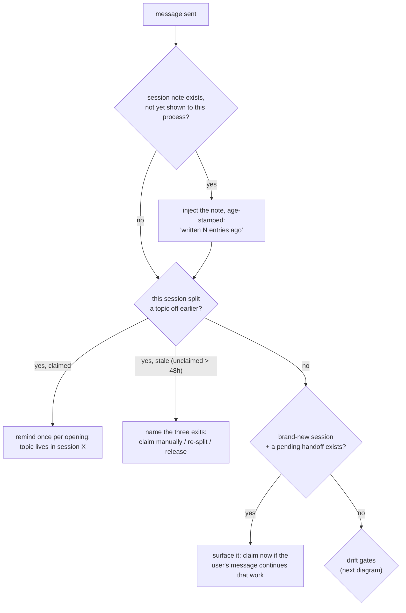
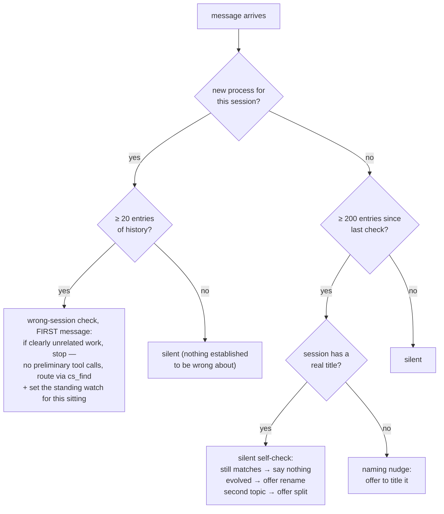
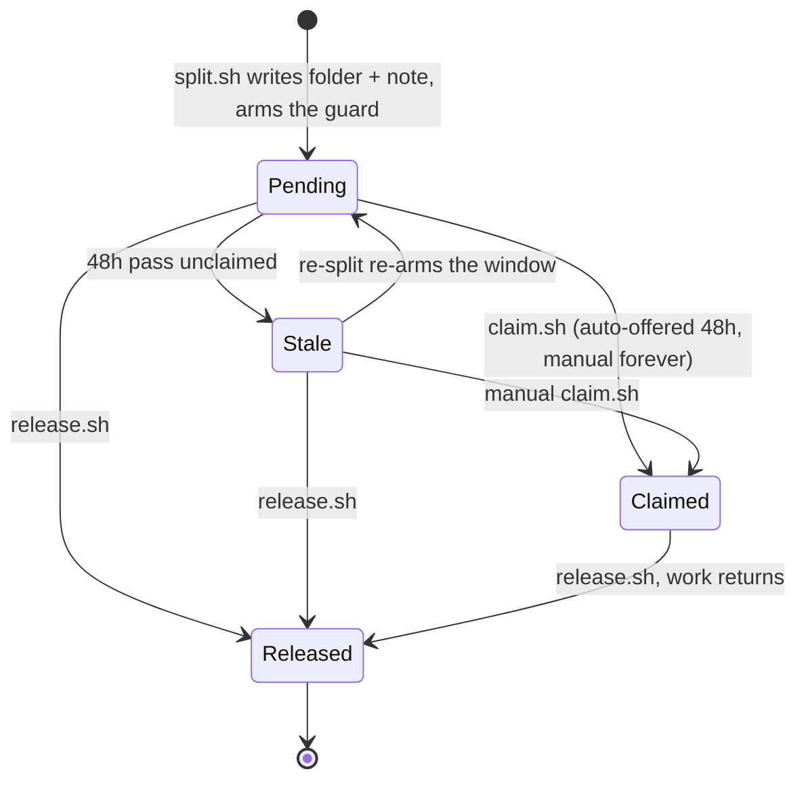
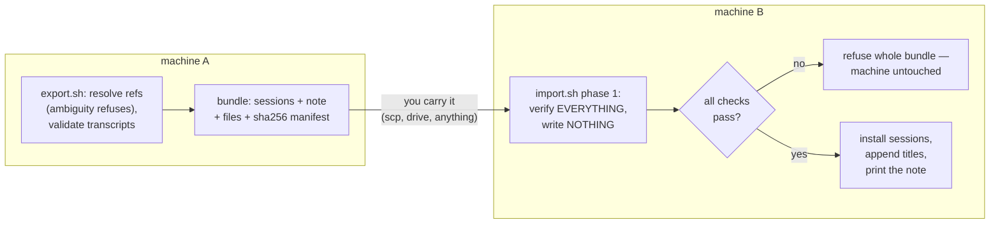
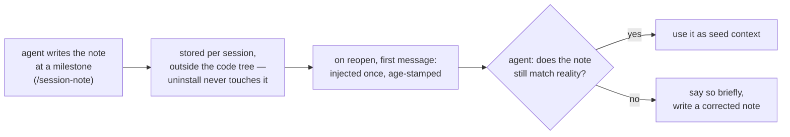

# How the kit behaves — flows and lifecycles

This is the behaviour reference: what runs when, and what state moves where. The
*reasons* live in the design docs — [DESIGN-naming.md](DESIGN-naming.md),
[DESIGN-handoff.md](DESIGN-handoff.md), [DESIGN-notes.md](DESIGN-notes.md) — each
decision recorded with what it overturned. Nothing here duplicates those; when a
box below seems arbitrary, the why is in a design doc.

One rule governs everything on this page: **hooks decide WHEN, the agent judges
WHAT.** Every semantic call — does this match the title, is this the wrong tab, is
the note stale — is made by the in-session agent, which already holds the whole
conversation. The hooks only schedule the questions, and every hook exits 0 and
prints nothing on every failure path: breaking a user's prompt is never worth a
feature.

## What runs on every message

Three `UserPromptSubmit` hooks, each gated so it speaks rarely and at most once per
opened session. (A fourth hook, `version-check`, runs at `SessionStart` — see the
last section.)

## The drift gates

The agent receiving these instructions stays silent while the session is healthy —
a wasted check costs one silent thought, never an interruption. That is what makes
the cadence numbers (20, 200, both env-tunable) low-stakes choices.

## Same-machine split — the lifecycle

A split writes a plain folder (no bundle: nothing crosses a machine gap) and moves
through these states:

What each side hears, per state:

| State | The old session (once per opening) | Fresh sessions (first message, once) |
|---|---|---|
| Pending | "topic moved; not claimed yet" | "a handoff is pending — claim it if this session is for it" |
| Stale | "never claimed, window passed" + the three exits | nothing (the window gates the nudge, never the claim) |
| Claimed | "topic lives in session X" | nothing |
| Released | nothing | nothing |

Constants: the folder and its note are **never deleted** by any transition — they
are the record of why the split happened. History questions to the old session are
never guarded; the old transcript is the only place the full argument survives.

## Cross-machine handoff

Import is atomic by construction: a tampered file or a diverged session refuses the
entire bundle, including its healthy sessions. Re-importing the same bundle is a
clean no-op (prefix comparison — the installed copy may have grown a title line or
new turns). Titles travel inside the manifest and are appended as `custom-title`
entries, so imported sessions show their real names in the target's session picker.

## Session notes

Writing replaces the previous note (the transcript keeps every old version). The
age stamp is the safety mechanism: a stale note presented as current is the one way
this feature can do harm, so every render carries "written N entries ago".

## Version safety

At `SessionStart`, `version-check.sh` compares the running Claude Code version with
the last version the kit was verified against on this machine. Unchanged → exit in
~10ms. Changed → run the real-data suite (`tests/smoke.sh`) in the background: pass
→ record the new version, warning gone; fail → record nothing, so the warning keeps
appearing (and a redacted, shareable failure report is written) until a human looks.
The failure mode of the automation is falling back to the manual process, loudly —
nothing silent.
