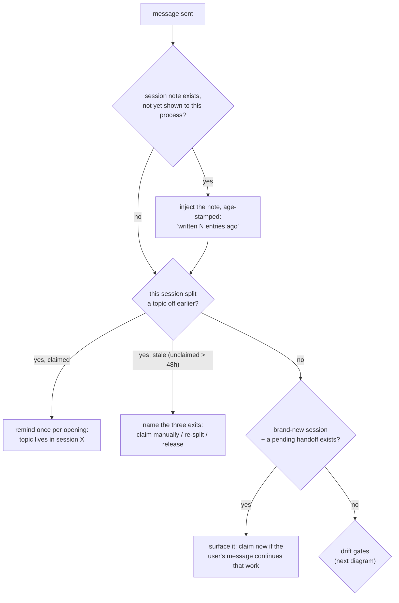
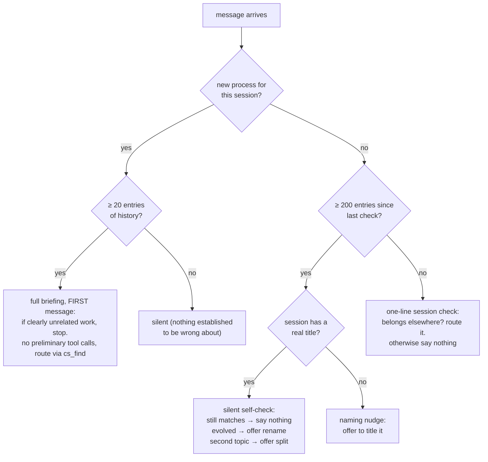
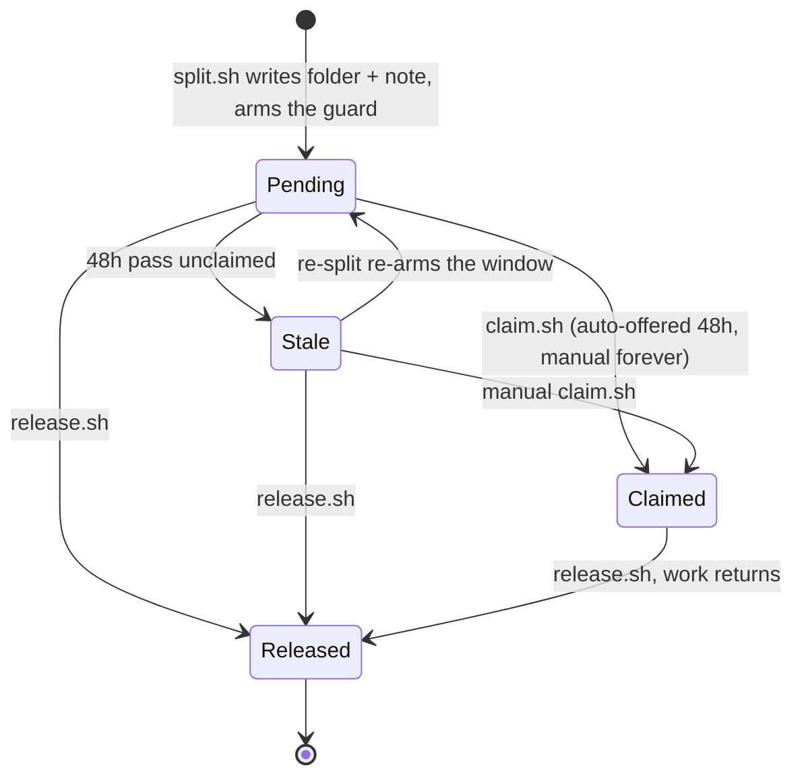
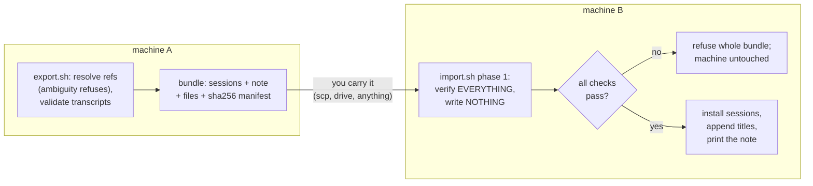
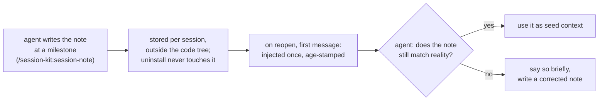

# How the kit behaves

Diagrams of what runs when, plus the specifics
[HOW-IT-WORKS.md](HOW-IT-WORKS.md) deliberately leaves out. The reasons behind each
choice live in the design docs: [DESIGN-naming.md](DESIGN-naming.md),
[DESIGN-handoff.md](DESIGN-handoff.md), [DESIGN-notes.md](DESIGN-notes.md),
[DESIGN-install.md](DESIGN-install.md). What those
decisions rest on, meaning the observed Claude Code behaviour rather than our choices, is
[INTERNALS.md](INTERNALS.md).

One rule keeps this file from growing into a second copy of the plain-language
version: a sentence that also belongs in HOW-IT-WORKS goes there, not here. What
lives here is the diagrams, and the detail a reader has to have asked for.

## What runs on every message

Three hooks look at each message you send. Each speaks at most once per opened
session, and usually not at all.



## The drift gates



The one-line check on the last branch is there because an off-topic message does not
politely arrive first. The full briefing is delivered once per opening, and for a long
sitting that is one delivery competing with everything that comes after it. The short
version repeats instead, so the check is present whenever a message is. It is still only
a hint: it offers the session `cs_find` found, a fresh session, or staying here, and the
user decides. The reasoning is D7 in [DESIGN-naming.md](DESIGN-naming.md).

The numbers (20 entries of history, a check every 200 entries) are deliberately
low-stakes. A check that finds nothing costs one silent thought, not an
interruption. All four knobs (these two, the 48-hour pickup window, and how new a
session must be to get offered pending handoffs) live in
`~/.claude/session-kit/config`, seeded at install with every default shown
commented out. The format is KEY=value, whole numbers only; the file is read,
never executed; a malformed value quietly falls back to its default; and an
environment variable with the same name overrides the file.

## Splitting a session on the same machine

Nothing is bundled or copied, because nothing leaves the machine. The split moves
through these states:



Who hears what, in each state:

| State | The old session (once per opening) | Fresh sessions (first message, once) |
|---|---|---|
| Pending | "topic moved; not claimed yet" | "a handoff is pending; claim it if this session is for it" |
| Stale | "never claimed, window passed" + the three exits | nothing (the window gates the nudge, never the claim) |
| Claimed | "topic lives in session X" | nothing |
| Released | nothing | nothing |

## Moving sessions to another machine



Importing the same bundle twice is safe and does nothing.

## Session notes



Writing a note replaces the previous one. The transcript keeps every old version
anyway, so nothing is lost by overwriting.

## Version safety

A session-start hook checks whether the running Claude Code version is one the kit
has already passed against on this machine. If it is, the hook exits in about ten
milliseconds. On a version it has not cleared before, it runs the real-data suite in
the background, at most once per day, and a pass clears the warning by itself.

The record is a list of every version that passed here, not only the newest, because
a machine often has several sessions open on different versions at once. Reopening an
older one is not news, and a pass on an older version never erases a newer one.

If that background run comes back FAILING, the next prompt hook to fire says so in one
line and points at the report. The same line reports a missing `jq`, which is the other
way the kit can stop working without appearing to. Both are throttled to once a day per
fault, and both clear themselves: the jq one when `jq` is back, the self-check one when
the suite next passes and deletes its report. It exists because silence is otherwise
ambiguous.

Two more checks speak uninvited, each at most once a day, each naming the command that
fixes what it found. At session start, the deployed kit and the installed plugin sitting on
different releases is reported, with the half that is behind named. After a pull in a
development checkout, files the installer deploys having changed since the deployed commit
are named, with `bash install.sh` as the fix. A third runs away from this machine entirely:
every newly published Claude Code build is probed weekly on GitHub for the names this kit
reads. The reasoning is in [DESIGN-install.md](DESIGN-install.md).

## Writing settings.json at install time

`~/.claude/settings.json` is the one file the kit shares with every other tool on the
machine, so it gets the most gates of anything the installer does, and it is written
last, after everything else is installed and checked.

```mermaid
flowchart TD
    A["install.sh"] --> T{"test suite passes?"}
    T -- no --> TX["refuse; nothing deployed"]
    T -- yes --> P1{"settings.json parses<br/>as an object?"}
    P1 -- no --> R1["refuse; name the file<br/>nothing deployed, file untouched"]
    P1 -- yes --> P2{"`hooks`, and each event<br/>WE wire, the right shape?"}
    P2 -- no --> R2["refuse; name the key<br/>nothing deployed, file untouched"]
    P2 -- yes --> D["deploy tree and config<br/>(skills come from the plugin)"]
    D --> M["merge on a snapshot,<br/>append only"]
    M --> V{"result valid JSON,<br/>and no fewer hooks?"}
    V -- no --> R3["discard the result;<br/>live file left alone"]
    V -- yes --> C{"would it change<br/>anything?"}
    C -- no --> N["write nothing at all"]
    C -- yes --> B["back up, then replace"]
    B --> F{"a later step fails?"}
    F -- yes --> RB["restore the backup"]
    F -- no --> OK["done"]
```

Both shape gates run *before* anything is deployed, which is the whole point of them:
a shape discovered mid-merge would mean reporting it after the tree and the config were
already on disk.

The second gate is scoped to the event keys in `settings.snippet.json`, not to every
event in your file. An event the kit does not wire is never read, so a wrong-shaped
one is not a reason to refuse; it survives install and uninstall untouched, and a test
says so. The list is derived from the snippet rather than written out, so wiring a new
event cannot forget to widen the check. Nothing is ever repaired automatically: a
wrongly-typed key holds something the installer did not write, and guessing at it is
the same overreach as refusing over it.

Ownership is by **basename plus directory**, `session-kit/hooks/`. Basename alone is
not enough, because a filename as ordinary as `session-note.sh` can belong to another
tool; when that happens the installer says so and leaves it, rather than counting it
as already-wired or removing it later.

Uninstall is the same contract backwards. It takes out only commands under
`session-kit/hooks/`, drops an event key once it holds nothing, and drops `hooks`
itself once no events remain, so an emptied file carries no leftover scaffolding. The
backup at `settings.json.session-kit.bak` is a one-step undo of the installer's last
real change, not an archive of your pre-kit config.
