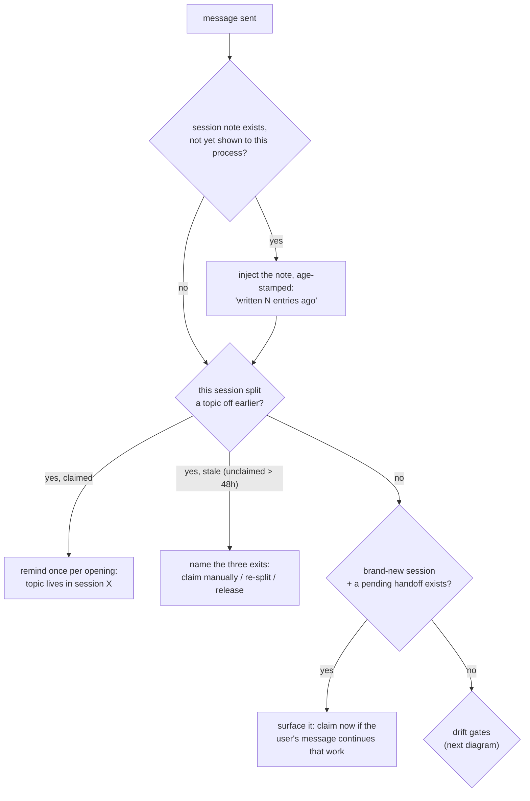
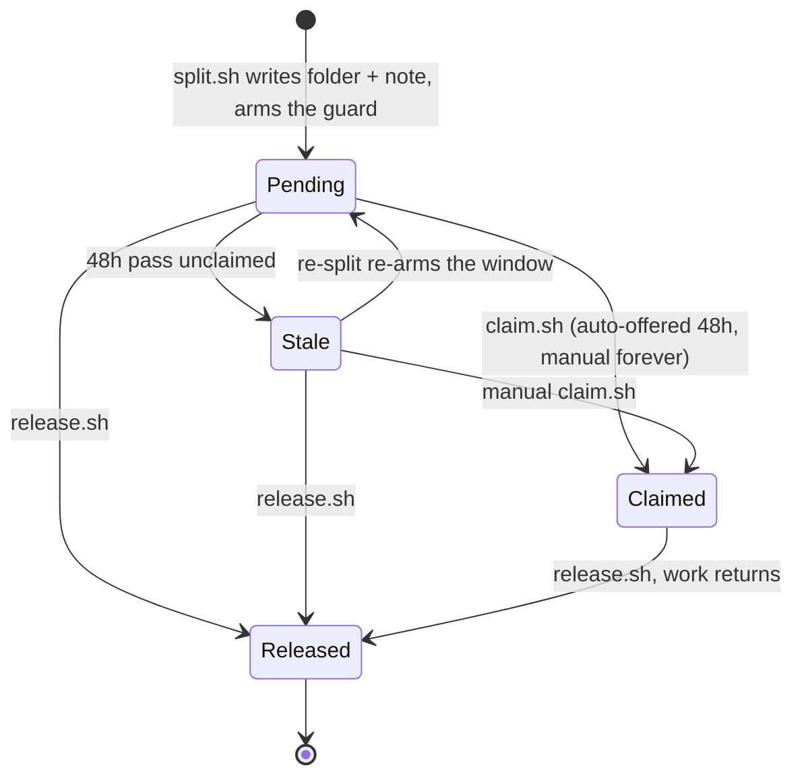
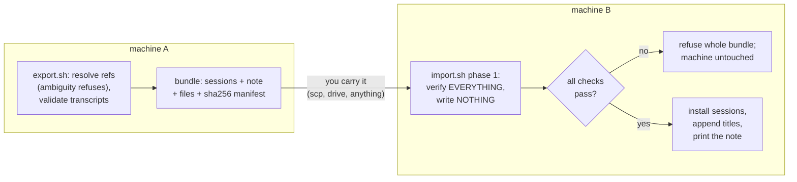

# How the kit behaves

Diagrams of what runs when, plus the specifics
[HOW-IT-WORKS.md](HOW-IT-WORKS.md) deliberately leaves out. The reasons behind each
choice live in the design docs: [DESIGN-naming.md](DESIGN-naming.md),
[DESIGN-handoff.md](DESIGN-handoff.md), [DESIGN-notes.md](DESIGN-notes.md).

One rule keeps this file from growing into a second copy of the plain-language
version: a sentence that also belongs in HOW-IT-WORKS goes there, not here. What
lives here is the diagrams, and the detail a reader has to have asked for.

## What runs on every message

Three hooks look at each message you send. Each speaks at most once per opened
session, and usually not at all.

## The drift gates

The numbers (20 entries of history, a check every 200 entries) are deliberately
low-stakes. A check that finds nothing costs one silent thought, not an
interruption. All four knobs (these two, the 48-hour pickup window, and how new a
session must be to get offered pending handoffs) live in
`~/.claude/session-kit/config`, seeded at install with every default shown
commented out. The format is KEY=value, whole numbers only; the file is read,
never executed; a malformed value quietly falls back to its default; and an
environment variable with the same name overrides the file.

## Splitting a session on the same machine

Nothing is bundled or copied, because nothing leaves the machine. The split moves
through these states:

Who hears what, in each state:

| State | The old session (once per opening) | Fresh sessions (first message, once) |
|---|---|---|
| Pending | "topic moved; not claimed yet" | "a handoff is pending; claim it if this session is for it" |
| Stale | "never claimed, window passed" + the three exits | nothing (the window gates the nudge, never the claim) |
| Claimed | "topic lives in session X" | nothing |
| Released | nothing | nothing |

## Moving sessions to another machine

Importing the same bundle twice is safe and does nothing.

## Session notes

Writing a note replaces the previous one. The transcript keeps every old version
anyway, so nothing is lost by overwriting.

## Version safety

A session-start hook compares the running Claude Code version with the last one the
kit was verified against on this machine. On a match it exits in about ten
milliseconds. On a new version it runs the real-data suite in the background, at
most once per day, and a pass clears the warning by itself.
